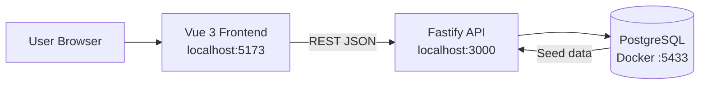
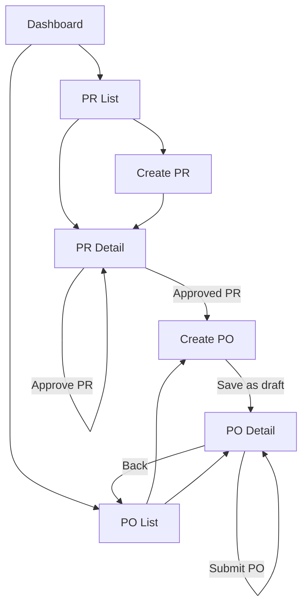
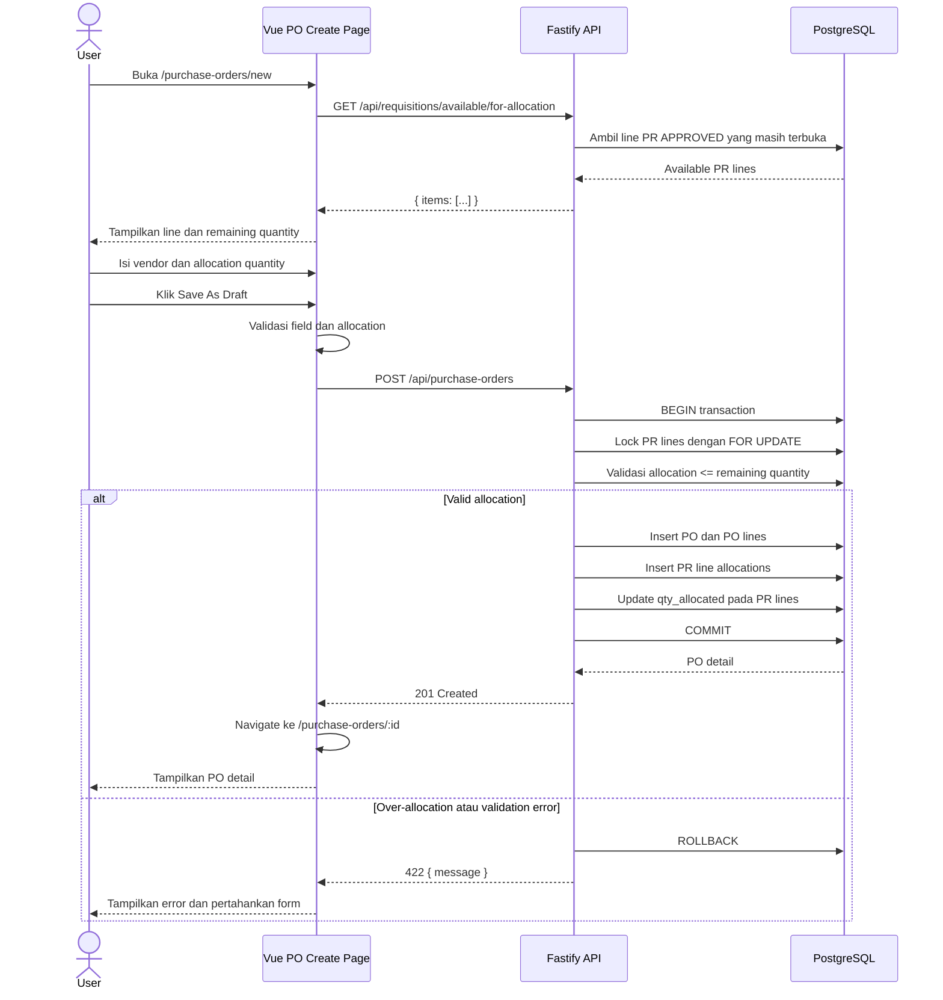

# Procurement MVP Application Guide

Dokumen ini menjelaskan cara kerja aplikasi Procurement MVP pada kondisi repository saat ini.

## 1. Ringkasan Aplikasi

Aplikasi ini membantu pengguna menjalankan alur pengadaan sederhana:

1. Membuat Purchase Requisition (PR).
2. Mengirim PR untuk diproses.
3. Menyetujui PR.
4. Membuat Purchase Order (PO) dari line PR yang sudah disetujui.
5. Mengirim PO ke vendor.

Goods Receipt (GR) sudah disiapkan pada skema database dan rencana workshop, tetapi belum menjadi modul UI/API aktif pada implementasi saat ini.

## 2. Arsitektur

Aplikasi terdiri dari tiga bagian utama:

- **Frontend:** Vue 3 dan Vite, berjalan pada port `5173`.
- **Backend:** Fastify JavaScript REST API, berjalan pada port `3000`.
- **Database:** PostgreSQL 16 dalam Docker, dipetakan ke port `5433`.



## 3. User Flow

Flow berikut menggambarkan journey utama yang tersedia pada aplikasi saat ini.



### Alur pengguna utama

1. Buka Dashboard.
2. Buka **Purchase Requisitions**.
3. Buat PR atau gunakan data seed yang tersedia.
4. Submit PR, lalu approve PR.
5. Buka **Purchase Orders**.
6. Pilih **New PO**.
7. Masukkan nama vendor.
8. Pilih line dari approved PR dan isi allocation quantity.
9. Simpan sebagai draft.
10. Review PO pada detail page.
11. Submit PO jika informasinya sudah benar.

Hanya line dari PR berstatus `APPROVED` yang tersedia untuk dialokasikan ke PO.

## 4. Sequence Diagram: Create PO

Diagram berikut menunjukkan komunikasi ketika pengguna membuat PO dari approved PR line.



## 5. Halaman Frontend

| Route | Halaman | Fungsi |
|---|---|---|
| `/` | Dashboard | Ringkasan jumlah PR dan navigasi modul |
| `/requisitions` | PR List | Menampilkan seluruh PR |
| `/requisitions/new` | PR Create | Membuat PR baru |
| `/requisitions/:id` | PR Detail | Melihat, submit, dan approve PR |
| `/purchase-orders` | PO List | Menampilkan seluruh PO |
| `/purchase-orders/new` | PO Create | Membuat PO dari approved PR lines |
| `/purchase-orders/:id` | PO Detail | Melihat PO dan submit PO draft |

Komponen PO yang digunakan:

- `POHeaderForm.vue`: input nama vendor.
- `POLineAllocationTable.vue`: memilih PR line, mengisi allocation quantity, dan unit price.

Navigasi utama tersedia pada navbar untuk **Dashboard**, **Purchase Requisitions**, dan **Purchase Orders**.

## 6. API yang Digunakan

### Purchase Requisition

| Method | Endpoint | Kegunaan |
|---|---|---|
| `GET` | `/api/requisitions` | List PR |
| `POST` | `/api/requisitions` | Create PR |
| `GET` | `/api/requisitions/:id` | Detail PR |
| `POST` | `/api/requisitions/:id/submit` | Submit PR |
| `POST` | `/api/requisitions/:id/approve` | Approve PR |
| `GET` | `/api/requisitions/:id/open-lines` | Line PR yang masih terbuka |
| `GET` | `/api/requisitions/available/for-allocation` | Approved PR lines untuk PO |

### Purchase Order

| Method | Endpoint | Kegunaan |
|---|---|---|
| `GET` | `/api/purchase-orders` | List PO |
| `POST` | `/api/purchase-orders` | Create PO draft |
| `GET` | `/api/purchase-orders/:id` | Detail PO |
| `POST` | `/api/purchase-orders/:id/submit` | Submit PO |
| `GET` | `/api/purchase-orders/:id/open-lines` | PO lines yang masih terbuka untuk GR |

API error dikembalikan sebagai JSON sederhana:

```json
{
  "message": "lines[0]: allocation qty 9 exceeds remaining 8"
}
```

Frontend mempertahankan HTTP status melalui `error.statusCode`, termasuk status `422` untuk validation/business rule errors.

## 7. Aturan Bisnis PO

### Allocation quantity

Allocation quantity tidak boleh melebihi remaining quantity pada PR line:

```text
new allocation <= qty_requested - qty_allocated
```

Validasi dilakukan pada dua lapisan:

- **Frontend:** memberi feedback langsung pada allocation table.
- **Backend:** menjadi validasi authoritative dalam transaction dengan row lock `FOR UPDATE`.

Jika aturan dilanggar, backend mengembalikan `422 Unprocessable Entity`, transaction di-rollback, dan PO tidak dibuat sebagian.

### Status transition

```text
PR: DRAFT -> SUBMITTED -> APPROVED
PO: DRAFT -> SUBMITTED
```

PO hanya bisa di-submit jika status awalnya `DRAFT`.

## 8. Menjalankan Aplikasi Secara Lokal

Prasyarat:

- Docker Desktop aktif.
- Node.js dan npm tersedia.

Dari root repository:

```powershell
docker compose up -d db
npm install
cd backend
npm install
cd ..\frontend
npm install
cd ..
npm run dev
```

URL aplikasi:

- Frontend: http://localhost:5173
- Backend: http://localhost:3000
- Health check: http://localhost:3000/health
- Swagger: http://localhost:3000/docs
- PostgreSQL: `localhost:5433`

Untuk reset database dan menjalankan migration/seed dari awal:

```powershell
docker compose down -v
docker compose up -d db
```

## 9. Testing

Unit/component test:

```powershell
npm test
```

Hasil yang diharapkan saat ini:

- Backend Jest: `29/29` passing.
- Frontend Vitest: `53/53` passing.

PO E2E test menggunakan Playwright:

```powershell
npx playwright test tests/e2e/po-module.spec.js
```

Test tersebut mencakup:

- Happy path create PO.
- Negative path over-allocation dengan response `422`.

Artifact Playwright:

- HTML report: `playwright-report/index.html`
- Screenshot, trace, video, dan JSON result: `test-results/`

Pre-push hook menjalankan `npm test` otomatis dan membatalkan push jika ada test yang gagal. Aktifkan hook pada clone baru dengan:

```powershell
npm run setup:hooks
```

## 10. Batasan Implementasi Saat Ini

- GR belum memiliki halaman dan endpoint aktif sebagai modul lengkap.
- Belum ada autentikasi atau multi-user permission.
- Belum ada pagination, reporting, notification, atau workflow engine.
- Database dan seed ditujukan untuk local workshop.

Untuk status implementasi lebih rinci, lihat [progress.md](progress.md) dan [plan.md](plan.md).
